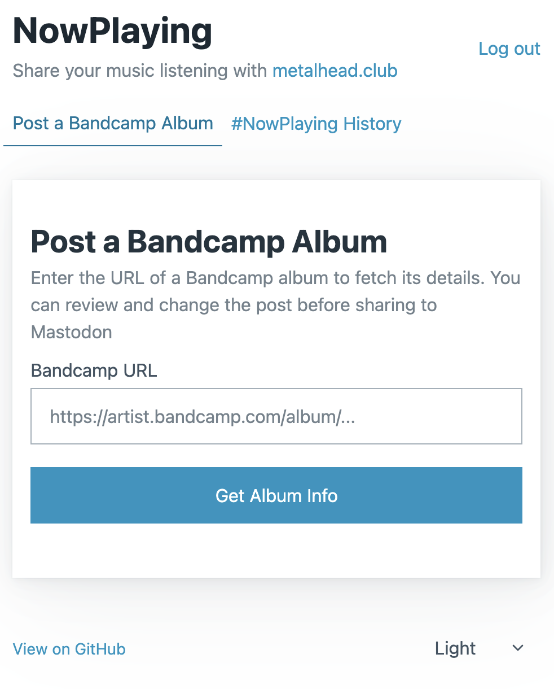

# NowPlaying: Bandcamp to Mastodon

A lightweight, self-hosted tool that lets you easily post Bandcamp albums to Mastodon with rich metadata and cover art.



## Features

- **Post an album from Bandcamp**: Paste a Bandcamp URL, and it fetches the album art, artist, and title.
- **Search your post history**: search for posts with the #nowplaying hastag and generate a collage of the covers, then post it to Mastodon
- **Dynamic Auth**: Works with any Mastodon instance.
- **Customizable**: Edit the text before you post.
- **Privacy-First**: No user data stored on the server.

## Quick Start

1. **Configure**: Copy `.env.example` to `.env` and set your `SESSION_SECRET`.
2. **Run**:
   ```bash
   docker-compose up -d
   ```
3. **Open**: Go to `http://localhost:4444`.

See [SETUP.md](SETUP.md) for detailed installation instructions.

## Technology

- **Backend**: ASP.NET Core 10 (Minimal APIs)
- **Frontend**: Vue.js 3 (ES Modules, no build step)
- **Container**: Docker

##  Contributing

PRs are welcome. Please not this is a GPL v3 licensed codebase and contributions will fall under than license. 

## License

GPL v3
